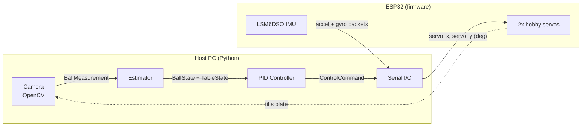

# ball-plate

A ball-on-plate balancing testbed: a camera tracks a ball on a tilting table, a Python host estimates the ball and table state in real time, and a PID controller drives two servos through an ESP32 to keep the ball at a target position.

**Status:** active build (summer 2026). The core loop — camera → state estimation → PID → servo actuation — is working; see the demo below. Kalman filtering and IMU gyro fusion are in progress (see [Roadmap](#roadmap)).

<!-- TODO: convert working_build.mp4 to a GIF and embed it here:
     ffmpeg -i working_build.mp4 -vf "fps=15,scale=480:-1" -loop 0 demo.gif
     then:  -->
[▶ Demo video: working build](working_build.mp4)

## System architecture

Vision, estimation, and control run on the host PC in Python. The ESP32 is a thin real-time I/O bridge: it streams IMU packets up and drives the servos from serial commands.



The data flow is explicit through typed state dataclasses (`src/ball_plate/state.py`):

```
BallMeasurement → estimator → BallState
IMUReading      → estimator → TableState
SystemState     → controller → ControlCommand
```

## How it works

### Perception (`perception.py`)
- HSV color masking + morphological open/close, then contour-moment centroid to get the ball's pixel coordinates.
- One-time calibration at startup: click the four table corners; the code orders them automatically, computes pixel→meter scales for both axes, and sets the table center as the coordinate origin.

### Estimation (`estimator.py`)
- Table roll/pitch from the IMU accelerometer (gravity vector), with finite-difference angular rates.
- Ball velocity by finite difference of positions.
- *In progress:* Kalman filter for the ball state and accel/gyro fusion for the table attitude — the current estimates are measurement-driven and noise-sensitive.

### Control (`control.py`)
- PID on ball position error (currently PD-dominant: `KP = 1.0`, `KD = 0.2`, `KI = 0.0`) producing a desired table tilt, with integrator anti-windup clamping and tilt saturation at ±10°.
- Inverse kinematics from desired tilt to servo angle: the required edge lift for a tilt θ is `(table_width / 2) · sin(θ)`, and the servo arm rotation is `asin(lift / arm_length)`, clamped to the asin domain so an unreachable tilt saturates instead of crashing.

### Actuation (firmware, `firmware/.../src/main.cpp`)
- ESP32 (PlatformIO) parses `"servo_x, servo_y\n"` degree commands over 115200-baud serial, constrains them to safe limits, and maps degrees to servo microseconds.
- Streams LSM6DSO accelerometer + gyro packets back over serial every 50 ms.
- `firmware/.../scratch/` holds standalone servo-calibration and serial-test sketches.

## Hardware

| Part | Details |
| --- | --- |
| MCU | ESP32 dev board |
| IMU | SparkFun LSM6DSO (I2C, mounted to the plate) |
| Actuation | 2× hobby servos (X and Y axes), 23 mm arms |
| Plate | 22 cm × 22 cm |
| Camera | USB webcam, fixed above the table <!-- TODO: model --> |
| Ball | <!-- TODO: ball type/size --> |

<!-- TODO: wiring diagram / photo of the build -->

## Repo layout

```
src/ball_plate/     # host: perception, estimator, control, serial I/O, config
firmware/           # ESP32 PlatformIO project + calibration scratch sketches
working_build.mp4   # demo of the current build
```

## Running it

Host (Python ≥ 3.14, managed with `uv`; camera capture is Linux/V4L2):

```bash
uv sync
# plug in the ESP32 (default port /dev/ttyUSB0, see config.py), then run the main loop:
uv run python -m ball_plate.ball_tracker_v2
# an exposure-adjustment window opens first, then click the 4 table corners to calibrate
```

Firmware: open `firmware/260530-200235-esp32dev/` with PlatformIO and upload to the ESP32.

Loop rates and geometry are configured in `src/ball_plate/config.py` (camera 60 Hz, control 50 Hz, table dimensions, servo arm length, ball color).

## Design decisions

- **Host/embedded split.** All the interesting math lives in Python where it's easy to iterate; the ESP32 does only hard-real-time work (servo pulses, IMU reads). The serial protocol between them is a plain-text line, trivially debuggable.
- **Typed state boundaries.** Each pipeline stage consumes and produces a dataclass, so every stage can be tested and swapped independently (e.g. replacing the finite-difference estimator with a Kalman filter changes one function, not the loop).
- **Saturate, don't crash.** Tilt commands clamp at ±10°, the IK clamps to the asin domain, and the integrator has anti-windup — the failure mode is a sluggish table, never an out-of-range servo command.

## Roadmap

- [ ] Kalman filter for ball state estimation (replace finite-difference velocities)
- [ ] Accel/gyro fusion for table attitude (complementary or Kalman)
- [ ] Velocity error term in the D-path (currently damps absolute velocity, not error rate)
- [ ] Color-mask robustness across lighting conditions
- [ ] Gain tuning + step-response plots (before/after)
- [ ] Restore/commit the `planning` module (`ball_tracker_v2.py` imports it but it's not in the package)
- [ ] Wire the `ball-plate` console entry point to the real loop (currently a placeholder stub)
- [ ] Demo GIF in this README
- [ ] Wiring diagram and full BOM
