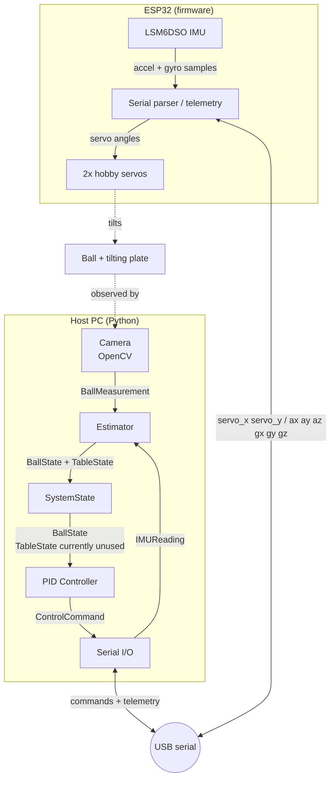

# ball-plate

A ball-on-plate balancing testbed: a camera tracks a ball on a tilting table, a Python host estimates the ball and table state in real time, and a PID controller drives two servos through an ESP32 to keep the ball at a target position.

**Status:** active prototype (summer 2026). The camera → finite-difference state estimation → PID → servo actuation loop is implemented; see the demo below. Kalman filtering and IMU gyro fusion are planned (see [Roadmap](#roadmap)).


## System architecture

Vision, estimation, and control run on the host PC in Python. The ESP32 streams IMU packets and drives the servos from serial commands.




The data flow is explicit through dataclasses in `src/ball_plate/state.py`:

```
BallMeasurement → estimator → BallState
IMUReading      → estimator → TableState
SystemState     → controller → ControlCommand
```


## How it works


### Perception (`perception.py`)

- HSV color masking + morphological open/close, then contour-moment centroid to get the ball's pixel coordinates.
- One-time calibration at startup: click the four table corners in any order; the code computes independent pixel→meter scales for both axes and sets the mean corner position as the origin. This is a scale-and-offset calibration, not a perspective correction, so the camera should be centered above the plate.


### Estimation (`estimator.py`)

- Table roll/pitch from the IMU accelerometer (gravity vector), with finite-difference angular rates.
- Ball velocity by finite difference of positions.
- *In progress:* Kalman filter for the ball state and accel/gyro fusion for the table attitude — the current estimates are measurement-driven and noise-sensitive.


### Control (`control.py`)

- PID on ball position error (currently PD-only: `KP = 80.0`, `KD = 20.0`, `KI = 0.0`) producing a desired table tilt, with integral clamping and tilt saturation at ±10°. The derivative term currently damps measured ball velocity.
- Inverse kinematics from desired tilt to servo angle: the required edge lift for a tilt θ is `(table_width / 2) · sin(θ)`, and the servo arm rotation is `asin(lift / arm_length)`, clamped to the asin domain so an unreachable tilt saturates instead of crashing.


### Actuation (firmware, `firmware/.../src/main.cpp`)

- ESP32 (PlatformIO) parses `"servo_x, servo_y\n"` degree commands over 115200-baud serial, constrains them to safe limits, and maps degrees to servo microseconds.
- Streams LSM6DSO accelerometer + gyro packets back over serial every 50 ms (20 Hz). The host currently uses only acceleration to estimate plate attitude.
- `firmware/.../scratch/` holds standalone servo-calibration and serial-test sketches.


## Hardware


| Part      | Details                                                                 |
| --------- | ----------------------------------------------------------------------- |
| MCU       | ESP32 dev board                                                         |
| IMU       | SparkFun LSM6DSO (I2C, mounted to the plate)                            |
| Actuation | 2× hobby servos (X and Y axes), 23 mm arms                              |
| Plate     | 22 cm × 22 cm                                                           |
| Camera    | Linux/V4L2 USB webcam, fixed above the table (`/dev/video0` by default) |
| Ball      |                                                                         |


## Repo layout

```
src/ball_plate/     # host: perception, estimator, control, serial I/O, config
firmware/           # ESP32 PlatformIO project + calibration scratch sketches
working_build_v*.gif   # demo of the current build version
```


## Running it

Host prerequisites:

- Python 3.14 or newer and `[uv](https://docs.astral.sh/uv/)`
- Linux with a V4L2 webcam and `v4l2-ctl` (usually provided by the `v4l-utils` package)
- An ESP32 attached over USB; the preferred port is `/dev/ttyUSB0`, with automatic fallback to other USB/ACM serial devices

Install and run:

```bash
uv sync
# Plug in the programmed ESP32, then run the main loop:
uv run python -m ball_plate.main
```

In the exposure window, use Up/Down to adjust brightness and Space to continue. In the calibration window, click all four plate corners in any order, press `r` to reset if needed, then press Space. Stop the loop with Ctrl+C or by closing/interruption; it currently has no dedicated quit key.

The `ball-plate` console command is still a placeholder; use the module command above.`pyproject.toml`/`uv.lock` define the supported environment.

Firmware: open `firmware/260530-200235-esp32dev/` with PlatformIO and upload to the ESP32.

Target loop rates and geometry constants are in `src/ball_plate/config.py` (camera Hz, control Hz, table dimensions, servo arm length, ball color, etc). 

## Design decisions

- **Host/embedded split.** Estimation and control live in Python for fast iteration; the ESP32 handles servo pulses, IMU reads, and serial I/O. The serial protocol is plain-text and line-oriented.
- **Typed state boundaries.** Each stage intakes and produces a dataclass, so every stage can be tested and swapped independently (e.g. replacing the finite-difference estimator with a Kalman filter changes one function, not the loop).
- **Bound actuator commands.** Tilt commands clamp at ±10°, inverse kinematics clamps the `asin` input, and firmware constrains servo commands to 60–120°. Integral state is also bounded.


## In Progress

- [ ] Kalman filter for ball state estimation 
- [ ] Accel/gyro fusion for table state
- [ ] Gain tuning + step-response plots (before/after)
- [ ] Wire the `ball-plate` console entry point to the real loop (currently a placeholder stub)
- [ ] Wiring diagram and full BOM